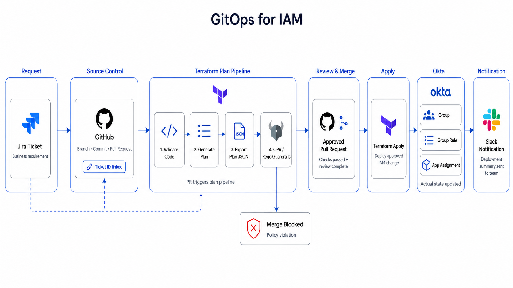

# IAM GitOps

Production-style Identity and Access Management (IAM) GitOps pipeline using Terraform, GitHub Actions, Open Policy Agent (OPA), and Okta.

This project demonstrates how modern IAM infrastructure can be managed using:

* Infrastructure as Code (IaC)
* Pull request approval workflows
* Policy-as-Code guardrails
* CI/CD pipelines
* Drift-aware IAM operations



## Demo Video

[](https://youtu.be/HMLmq9Ye0Ow)

Watch the full demo: [IAM GitOps Demo](https://youtu.be/HMLmq9Ye0Ow)
---

# Architecture

```txt
Plane / Jira Ticket
        ↓
GitHub Branch
        ↓
Terraform IAM Change
        ↓
Pull Request
        ↓
GitHub Actions CI/CD
        ↓
Terraform Plan
        ↓
OPA Policy Validation
        ↓
Approval
        ↓
Terraform Apply
        ↓
Okta
        ↓
Drift Detection + Slack Alert
```

---

# Features

* Terraform-based Okta resource management
* GitHub Actions CI/CD pipeline
* OPA policy guardrails
* IAM naming convention enforcement
* Pull request validation workflow
* Terraform plan generation
* Slack alert integration
* Drift detection foundation

---

# Technology Stack

| Component              | Technology        |
| ---------------------- | ----------------- |
| IAM Platform           | Okta              |
| Infrastructure as Code | Terraform         |
| CI/CD                  | GitHub Actions    |
| Policy Engine          | Open Policy Agent |
| Notifications          | Slack             |
| Change Management      | Plane             |

---

# Current IAM Guardrails

## Allowed Group Prefixes

```txt
Users-
Apps-
Roles-
Admin-
```

## Blocked Changes

* Invalid group naming standards
* Unauthorized IAM policy structures


# CI/CD Workflow

## Pull Request Workflow

Runs automatically when a pull request is created against `main`.

### Pipeline Steps

* Terraform fmt
* Terraform init
* Terraform validate
* Terraform plan
* Export Terraform JSON plan
* OPA policy evaluation
* Block unsafe IAM changes

---

# Example Workflow

```txt
Feature Branch
      ↓
Pull Request
      ↓
Terraform Plan
      ↓
OPA Guardrails
      ↓
Approval
      ↓
Merge
```

---

# OPA Policy Validation

OPA evaluates Terraform plan JSON before deployment.

Example protected rules:

```txt
- Prevent SuperAdmins group creation
- Enforce IAM naming conventions
- Block risky IAM patterns
```

---

# Local Development

## Terraform

```bash
terraform init
terraform validate
terraform plan -out=tfplan
terraform show -json tfplan > plan.json
```

## OPA Validation

```bash
opa eval \
  --data policy/okta.rego \
  --input plan.json \
  "data.okta.guardrails.deny"
```

---

# GitHub Secrets Required

Configure the following repository secrets:

```txt
OKTA_ORG_NAME
OKTA_BASE_URL
OKTA_API_TOKEN
SLACK_WEBHOOK_URL
```

---

# Example IAM Resources

## Groups

```txt
Users-Finance
Apps-Neobank
Roles-Approver
Admin-Neobank
```

# Why This Project Exists

Traditional IAM operations are often:

* manual
* difficult to audit
* prone to drift
* inconsistent across environments

This project demonstrates how IAM infrastructure can adopt:

* GitOps
* CI/CD
* policy-as-code
* engineering-driven governance

to improve:

* security
* auditability
* operational consistency
* IAM change management

---

# Github Workflow Explanation

## terraform-plan.yaml

This workflow runs whenever a pull request is opened, updated, or reopened against the master branch. It validates Terraform formatting, initializes Terraform, checks configuration validity, and generates a Terraform plan for the proposed IAM change.

 The plan is exported as JSON so OPA can inspect the actual Okta changes before deployment. OPA evaluates the plan against IAM guardrails defined in policy/okta.rego. If violations are found, the PR check fails and blocks the change from being merged. If no violations exist, the PR is considered safe for review and approval.
 
  This gives IAM admins and developers early feedback before changes reach the apply pipeline.

## terraform-apply.yaml
This GitHub Actions workflow automates Terraform-based IAM deployments to Okta after changes are merged into the master branch. The pipeline validates Terraform formatting, initializes providers, validates configuration, and generates a Terraform execution plan. 

The plan is exported as JSON and evaluated using Open Policy Agent (OPA) guardrails to detect unsafe IAM changes before deployment. If policy violations are found, the deployment is blocked automatically. Approved changes are applied to Okta using the reviewed Terraform plan. Deployment summaries are generated from Terraform output and sent to Slack for operational visibility. Failed deployments also trigger Slack alerts with debugging context. This workflow demonstrates GitOps-style IAM automation, policy-as-code enforcement, and secure CI/CD-based identity infrastructure management.

## drift-detection.yaml

This workflow performs on-demand Okta drift detection for Terraform-managed IAM resources. It is triggered manually or by an external Okta event hook workflow using workflow_dispatch. The pipeline initializes Terraform, lists resources currently managed in Terraform state, and runs terraform plan -detailed-exitcode to compare the approved Git/Terraform state against the live Okta environment. 

Exit code 0 means no drift, 2 means drift detected, and 1 means Terraform failed. When drift is found, the workflow exports the plan as JSON, builds a resource-level drift summary, uploads plan artifacts, and sends a Slack alert. The alert includes the trigger reason, Okta event type, workflow run link, and changed managed resources. The workflow intentionally fails when drift exists so the issue is visible in GitHub

# Disclaimer

This project is intended for educational, research, and portfolio purposes to demonstrate modern IAM engineering workflows and GitOps-style identity infrastructure management.
